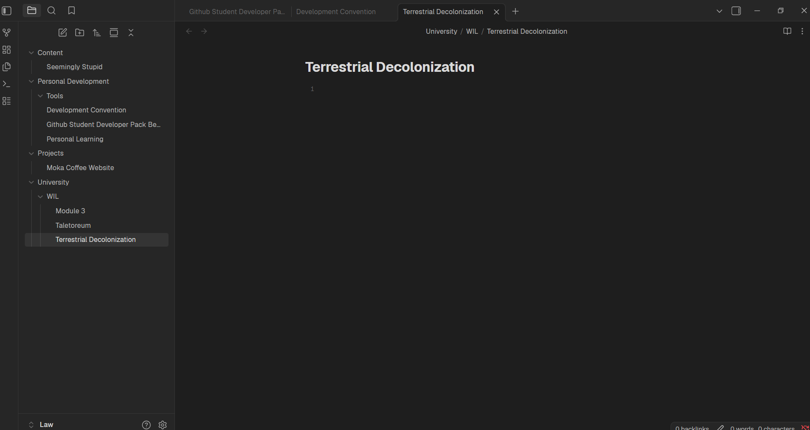
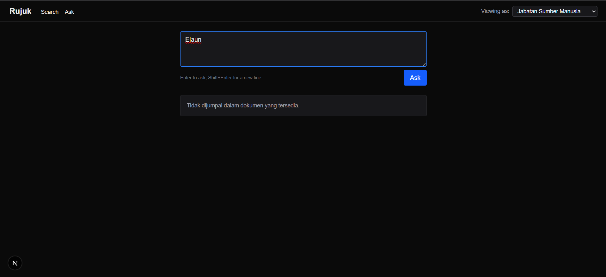

# Rujuk

Rujuk is document search and Q&A for government agencies, built for an AWS hackathon in 4 hours. It ingests PDFs, including scans, and indexes them with hybrid keyword and vector search. Staff ask in Malay or English and get cited answers with the source page highlighted.

## What it does

- **Search by meaning.** Find the right circular, SOP or minutes in plain language, not exact keywords.
- **Cited answers.** Ask a question and get a short answer where every claim links to its document and page.
- **One click to the source.** The cited page opens with the passage highlighted, so staff can verify it.
- **Bilingual.** Ask in Malay or English and get answers from documents in either language.
- **Knows what is outdated.** When a newer circular replaces an older one, the old one is badged as superseded and ranked lower.
- **Department view.** Each view shows that department's documents plus general ones.
- **Built on AWS.** Amazon Bedrock runs the embeddings and Claude, with the Groq free tier as a fallback.

## Team

- Lawrence Lian Anak Matius Ding (102789563): Prepped the repo, UI, seed corpus, demo
- Malissa (104394134): ingest pipeline
- Noah (104403881): index and retrieval
- Cyndia (104381602): API and answer generation

## Screenshots

Search results with tags and the Superseded badge:

For ask screenshot document:

## Documentation

- [docs/GETTING-STARTED.md](docs/GETTING-STARTED.md): read first to install, configure, run, and test.
- [docs/SYSTEM-DESIGN.md](docs/SYSTEM-DESIGN.md): read to understand the problem, architecture, and key decisions.
- [docs/backend/BACKEND-ARCHITECTURE.md](docs/backend/BACKEND-ARCHITECTURE.md): read before working on `engine/` or `api/`.
- [docs/frontend/FRONTEND-ARCHITECTURE.md](docs/frontend/FRONTEND-ARCHITECTURE.md): read before working on `web/`.
- [docs/DEMO.md](docs/DEMO.md): read before presenting or recording the demo.
- [docs/PLAN.md](docs/PLAN.md): read to see who owns which task and the order of work.
- [docs/AGENT-PROMPTS.md](docs/AGENT-PROMPTS.md): read when you hand a task to a coding agent.
- [contracts/README.md](contracts/README.md): read before touching any shared data shape or API route.
- [AGENTS.md](AGENTS.md): read for repo rules, layout, stack, and the docs writing convention.

## Submission checklist

- Repository is public
- README lists all group members
- README has 2 to 3 screenshots
- `docs/DEMO.md` has the three demo questions and the backup recording link
